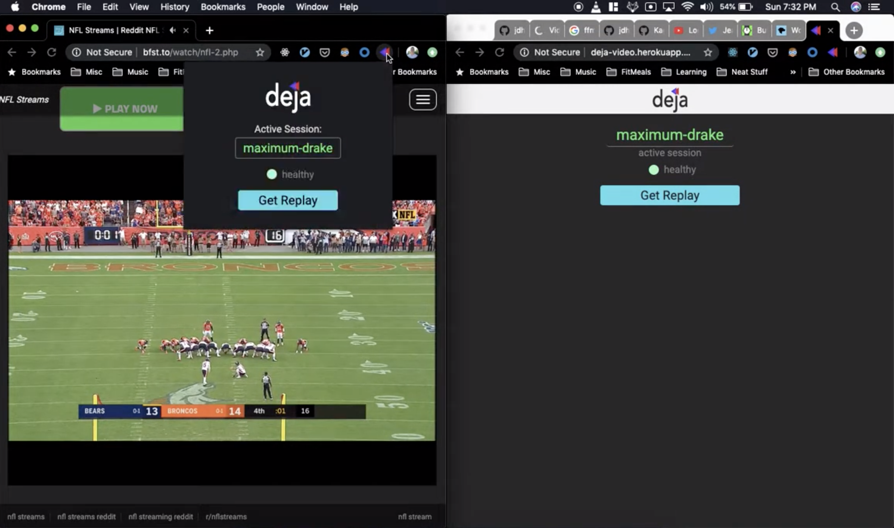
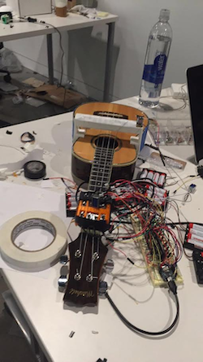
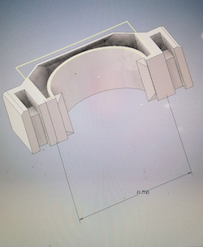
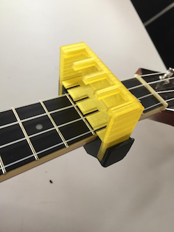

## My Workshop

Welcome! Below you will find some of the projects I am currently working on, as well as projects I have stopped development on. If anything here interests you or you are interested in colloborating on building something with me, please feel free to reach out. Enjoy :)

Deja
---

[Video Demo](https://www.youtube.com/watch?v=8sKslLUpeCs)

> Go, FFMPEG, React/Redux, Javascript

_[Chrome Extension](https://chrome.google.com/webstore/detail/deja-extension/fadmeenbclggopfangnbjmfbleffocnb) + [React Frontend](http://deja.video) + Go API_

Deja lets you grab your own replays from live streams from all around the internet. The Chrome Extension allows you to start a session that "records" the stream. During this session, replays can be created at any time from the extension or from the [deja.video](http://deja.video) web application (mobile-friendly).

[Link to repository](https://github.com/jdhayford/deja)

Frak
---
[Demo](https://imgur.com/a/YwX6lmY)

> React, Javascript

_Unreleased Chrome Extension_

A runnning experiment to test the feasibility of creating a reliable tool for downloading playback directly from a video element on any page (other than videos protected by EME).

Shotgun
---

> React, Redux, Javascript

[_Chrome Extension_](https://chrome.google.com/webstore/detail/shotgun-game-pass-enhance/lnbibfnchjpelopboeelajjgebgoplmn)

A simple Chrome Extension for enhancing the NFL GamePass website experience for power users, sports journalists and film analysts. Adds a simple search bar into the "play list" sidebar to allow you to quickly search by player and favorite plays for later use.

Cornell Pulse [inactive]
---

> Nodejs, React, Javascript

This was a mobile-first web application that I conceived of and built that showed real time activity at university facilities: 5 gyms and 29 campus dining locations used by the Cornell community. Unfortunately due to me delaying on an official release, it was primarily used by myself and people I knew (hard lesson learned on letting perfection be the enemy of good). I sunsetted it when I left Cornell and since then the project has been rebuilt (much better) by the talented people of the  Cornell Design and Tech Initiative and turned into the mobile app dubbed ["Flux"](https://www.cornelldti.org/Projects/flux)

StreamSurfer [inactive]
---

> Django w/ Celery API + React Frontend

This web application periodically scraped posts to various Reddit subreddits for "streams" of sporting events, parsed them and created a structured data representation of upcoming games, the teams involved and what streams were available on an easy to use UI. I decomissioned it due to /r/soccer being banned (thoroughly) and just to avoid possibilities of litigation altogether.

____

### Things I built during Grad School

Uke Machina - Self Playing Ukulele[2016]
---

[Video Demo](https://www.youtube.com/watch?v=XjbdhokM8rI&feature=youtu.be)

For our Rapid Prototyping class, we were tasked to build something audacious combining all of the things we were learning (3D printing, circuitry and arduino programming). My bias towards the wonderful 4-stringed instrument led to us building a ukulele that could play "Somewhere over the Rainbow". One of my favorite projects yet.
