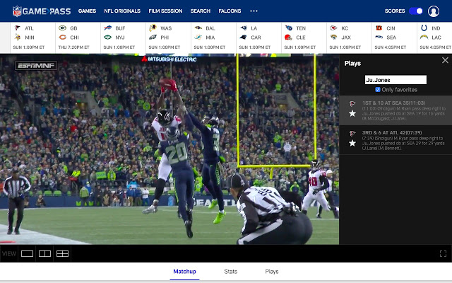
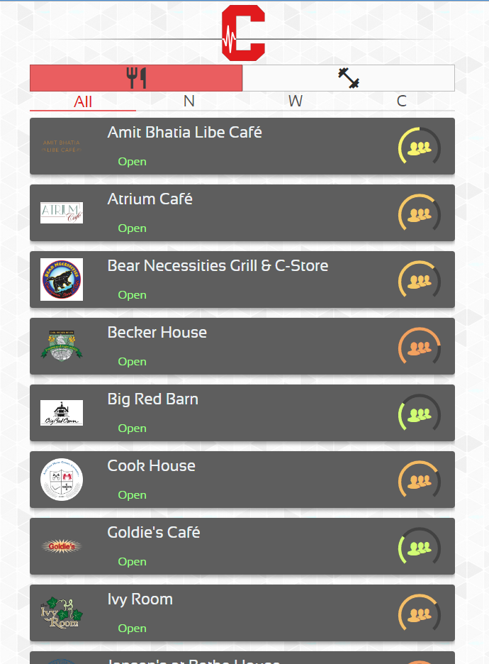

Welcome! Instead of building a portfolio site, I figured I would just keep a running list of my projects here. Below you will find the projects I am currently working on, as well as projects I have stopped development on. I welcome any and all inquiries.

### _Current_

Deja
---
[Demo](https://imgur.com/a/LebXSez)

> Go, FFMPEG, React/Redux, Javascript

_API + [React Frontend](http://deja.video) + Unreleased Chrome Extension_

Deja lets you grab your own replays from live streams from all around the internet. The Chrome Extension (unreleased) allows you to start a session that "records" the stream. During this session, replays can be created at any time from the extension or from the deja.video web application (mobile-friendly).

Frak
---
[Demo](https://imgur.com/a/YwX6lmY)

> React, Javascript

_Unreleased Chrome Extension_

A runnning experiment to test the feasibility of creating a reliable tool for downloading playback directly from a video element on any page (other than videos protected by EME).

Shotgun
---

> React, Redux, Javascript

[_Chrome Extension_](https://chrome.google.com/webstore/detail/shotgun-game-pass-enhance/lnbibfnchjpelopboeelajjgebgoplmn)

A simple Chrome Extension for enhancing the NFL GamePass website experience for power users, sports journalists and film analysts. Adds a simple search bar into the "play list" sidebar to allow you to quickly search by player and favorite plays for later use.

### _Past_

Cornell Pulse
---

> Nodejs, React, Javascript

This was a mobile-first web application that I conceived of and built that showed real time activity at university facilities: 5 gyms and 29 campus dining locations used by the Cornell community. I sunsetted it when I left Cornell and since then the project has been rebuilt (much better) by the talented people of the  Cornell Design and Tech Initiative and turned into the mobile app dubbed ["Flux"](https://www.cornelldti.org/Projects/flux)

StreamSurfer
---

> Django w/ Celery API + React Frontend

This web application periodically scraped posts to various Reddit subreddits for "streams" of sporting events, parsed them and created a structured data representation of upcoming games, the teams involved and what streams were available on an easy to use UI. I decomissioned it due to /r/soccer being banned (thoroughly) and just to avoid possibilities of litigation altogether.

